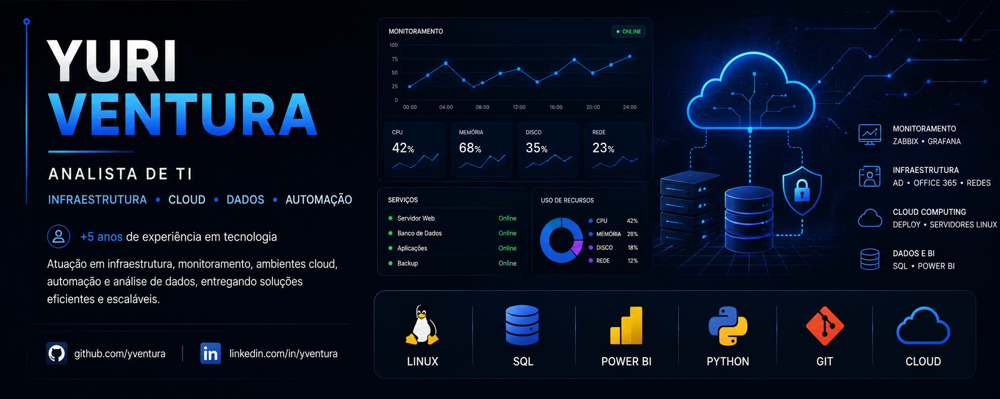

  

---

## 🎯 Foco em Dados, Cloud Computing e Engenharia de Dados

- Python (análise e automação de dados)  
- SQL (modelagem e consultas)  
- Power BI (dashboards e análise de dados)  
- Modelagem de dados  
- ETL / ELT (conceitos e práticas iniciais)  
- Cloud Computing (fundamentos e serviços essenciais)

---

## 📌 Objetivo

Atuar em projetos de dados, apoiando na construção de pipelines, análise de dados e desenvolvimento de soluções em ambientes de cloud.

---

## Estatísticas GitHub

---

## Contato

